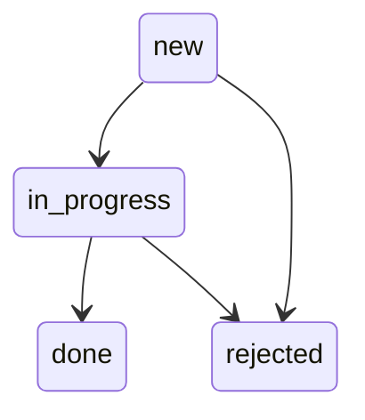

# Equipment Maintenance API

REST API на Express для учёта заявок на техническое обслуживание оборудования производственной площадки (ветропарк). Сервис ведёт справочник оборудования, заявки на его обслуживание, контролирует жизненный цикл заявки и оценивает погодные условия перед планированием наружных работ.

## Требования к окружению

- Node.js 20+
- npm 10+
- (опционально) Docker + Docker Compose

## Установка и запуск

### Локально

```bash
git clone <URL этого репозитория>
cd equipment-maintenance-api
npm install
cp .env.example .env
npm run dev
```

Сервер стартует на порту из `.env` (по умолчанию `3000`). Проверка: `curl http://localhost:3000/api/health`.

Данные хранятся в JSON-файлах в папке `data/` (создаётся автоматически при первом запуске, не коммитится в git).

### Через Docker Compose

```bash
cp .env.example .env
docker compose up --build
```

Данные сохраняются в `./data` на хосте (volume), переживают `docker compose down`.

### Веб-интерфейс

После запуска сервера откройте `http://localhost:3000` в браузере — доступна простая страница со списком заявок, фильтрами и формой создания.

## Переменные окружения

| Переменная | Назначение | Пример |
|---|---|---|
| `PORT` | Порт сервера | `3000` |
| `NODE_ENV` | Режим (`development`/`production`/`test`) — в production скрываются внутренние сообщения 500-ошибок | `development` |
| `CORS_ORIGINS` | Разрешённые origin через запятую | `http://localhost:5173` |
| `RATE_LIMIT_WINDOW_MS` | Окно ограничения частоты запросов, мс | `60000` |
| `RATE_LIMIT_MAX` | Макс. запросов за окно | `100` |
| `WEATHER_API_URL` | URL погодного API (Open-Meteo forecast) | `https://api.open-meteo.com/v1/forecast` |
| `REQUEST_TIMEOUT_MS` | Таймаут запроса к внешнему API | `5000` |
| `WEATHER_MAX_PRECIPITATION_MM` | Порог осадков для пригодности окна работ | `0` |
| `WEATHER_MAX_WIND_SPEED_KMH` | Порог скорости ветра | `20` |
| `API_KEY` | Ключ для изменяющих операций (POST/PATCH/DELETE), заголовок `X-API-Key` | сгенерировать самостоятельно |

## Эндпоинты

| Метод | Путь | Назначение | Требует `X-API-Key` |
|---|---|---|---|
| GET | `/api/health` | Проверка доступности сервиса | нет |
| GET | `/api/equipment` | Список оборудования (фильтры: `type`, `status`; сортировка `sort`; пагинация `page`, `limit`) | нет |
| POST | `/api/equipment` | Создание оборудования | да |
| GET | `/api/equipment/:id` | Карточка оборудования | нет |
| PATCH | `/api/equipment/:id` | Частичное обновление | да |
| DELETE | `/api/equipment/:id` | Удаление (409, если есть незакрытые заявки) | да |
| GET | `/api/equipment/:id/requests` | Заявки по конкретной единице оборудования | нет |
| GET | `/api/equipment/:id/weather` | Прогноз погоды и пригодность окна для наружных работ | нет |
| GET | `/api/requests` | Список заявок (фильтры: `status`, `priority`, `equipmentId`, `dateFrom`, `dateTo`; сортировка; пагинация) | нет |
| POST | `/api/requests` | Создание заявки | да |
| POST | `/api/requests/bulk` | Массовый импорт заявок с частичным успехом (207) | да |
| GET | `/api/requests/:id` | Карточка заявки | нет |
| PATCH | `/api/requests/:id` | Редактирование полей заявки (без смены статуса) | да |
| PATCH | `/api/requests/:id/status` | Смена статуса с проверкой допустимости перехода | да |
| DELETE | `/api/requests/:id` | Удаление заявки | да |

Списочные эндпоинты возвращают `{ data: [...], meta: { total, page, limit } }`.

## Модель данных

### Equipment

| Поле | Тип | Примечание |
|---|---|---|
| `id` | string (uuid) | генерируется сервером |
| `name` | string, 3–100 симв. | обязательное |
| `type` | `turbine \| inverter \| sensor \| substation` | |
| `serialNumber` | string | уникален в системе |
| `location` | `{ lat: number, lon: number }` | |
| `status` | `operational \| maintenance \| fault \| decommissioned` | |
| `installedAt` | ISO-дата | не в будущем |
| `createdAt`, `updatedAt` | ISO-дата-время | проставляются сервером |

### Maintenance Request

| Поле | Тип | Примечание |
|---|---|---|
| `id` | string (uuid) | генерируется сервером |
| `equipmentId` | string (uuid) | ссылка на существующее оборудование |
| `title` | string, 5–120 симв. | обязательное |
| `description` | string, до 2000 симв. | необязательное |
| `priority` | `low \| medium \| high \| critical` | |
| `status` | `new \| in_progress \| done \| rejected` | по умолчанию `new`, меняется только через `PATCH /:id/status` |
| `plannedAt` | ISO-дата-время | необязательное |
| `createdAt`, `updatedAt` | ISO-дата-время | проставляются сервером |

## Схема переходов статуса заявки



Из статусов `done` и `rejected` переходы запрещены. Попытка недопустимого перехода — `409 CONFLICT` (код ошибки `INVALID_TRANSITION`).

## Формат ответа об ошибке

Все ошибки API возвращаются в едином формате:

```json
{
  "error": {
    "code": "VALIDATION_ERROR",
    "message": "Некорректные данные запроса",
    "details": [
      { "field": "priority", "message": "Invalid enum value" }
    ],
    "requestId": "b1f2c3d4"
  }
}
```

`details` присутствует только для ошибок валидации. `requestId` возвращается в каждом ответе об ошибке и в заголовке `X-Request-Id` любого ответа — по нему можно найти соответствующую запись в логах сервера.

| Код ошибки | HTTP-статус | Когда возникает |
|---|---|---|
| `VALIDATION_ERROR` | 422 | Некорректные данные в body/params/query |
| `NOT_FOUND` | 404 | Сущность или маршрут не найдены |
| `CONFLICT` | 409 | Дубль serialNumber, удаление equipment с открытыми заявками |
| `INVALID_TRANSITION` | 409 | Попытка недопустимого перехода статуса заявки |
| `UNAUTHORIZED` | 401 | Отсутствует или неверен `X-API-Key` для изменяющей операции |
| `RATE_LIMIT_EXCEEDED` | 429 | Превышен лимит запросов |
| `WEATHER_TIMEOUT` / `WEATHER_UNAVAILABLE` | 503 | Внешний погодный API не ответил вовремя или недоступен |
| `INTERNAL_ERROR` | 500 | Непредвиденная ошибка сервера (детали скрыты в production) |

**Почему 422, а не 400, для ошибок валидации**: 400 используется для синтаксически некорректных запросов (например, невалидный JSON), 422 — когда синтаксис верный, но содержимое не проходит бизнес-проверки схемы (обязательные поля, enum-значения, форматы). Этот выбор зафиксирован и последовательно применяется во всём API.

## Примеры запросов и ответов

### Создание оборудования

Запрос:
```http
POST /api/equipment
Content-Type: application/json
X-API-Key: <ключ>

{
  "name": "Turbine A",
  "type": "turbine",
  "serialNumber": "SN-001",
  "location": { "lat": 56.50049, "lon": 84.98216 },
  "status": "operational",
  "installedAt": "2024-01-01"
}
```

Ответ `201 Created` (заголовок `Location: /api/equipment/<id>`):
```json
{
  "id": "3f2504e0-4f89-11d3-9a0c-0305e82c3301",
  "name": "Turbine A",
  "type": "turbine",
  "serialNumber": "SN-001",
  "location": { "lat": 60.1, "lon": 24.9 },
  "status": "operational",
  "installedAt": "2024-01-01",
  "createdAt": "2026-09-20T10:00:00.000Z",
  "updatedAt": "2026-09-20T10:00:00.000Z"
}
```

### Ошибка валидации

Запрос:
```http
POST /api/equipment
Content-Type: application/json
X-API-Key: <ключ>

{ "type": "turbine" }
```

Ответ `422 Unprocessable Entity`:
```json
{
  "error": {
    "code": "VALIDATION_ERROR",
    "message": "Некорректные данные запроса",
    "details": [
      { "field": "name", "message": "Required" },
      { "field": "serialNumber", "message": "Required" },
      { "field": "location", "message": "Required" },
      { "field": "status", "message": "Required" },
      { "field": "installedAt", "message": "Required" }
    ],
    "requestId": "a1b2c3d4"
  }
}
```

### Недопустимый переход статуса

Запрос:
```http
PATCH /api/requests/<id>/status
Content-Type: application/json
X-API-Key: <ключ>

{ "status": "done" }
```

(если текущий статус заявки — `new`)

Ответ `409 Conflict`:
```json
{
  "error": {
    "code": "INVALID_TRANSITION",
    "message": "Переход из \"new\" в \"done\" недопустим",
    "requestId": "e5f6a7b8"
  }
}
```

### Массовый импорт заявок (частичный успех)

Запрос:
```http
POST /api/requests/bulk
Content-Type: application/json
X-API-Key: <ключ>

{
  "items": [
    { "equipmentId": "<id>", "title": "Успешная заявка", "priority": "low" },
    { "equipmentId": "00000000-0000-4000-8000-000000000000", "title": "Несуществующее оборудование", "priority": "low" }
  ]
}
```

Ответ `207 Multi-Status`:
```json
{
  "summary": { "total": 2, "succeeded": 1, "failed": 1 },
  "results": [
    { "index": 0, "success": true, "data": { "id": "...", "status": "new" } },
    { "index": 1, "success": false, "error": { "code": "NOT_FOUND", "message": "Оборудование с id=... не найдено" } }
  ]
}
```

### Запрос без API-ключа на изменяющую операцию

Ответ `401 Unauthorized`:
```json
{
  "error": {
    "code": "UNAUTHORIZED",
    "message": "Требуется корректный API-ключ",
    "requestId": "c3d4e5f6"
  }
}
```

## Безопасность

### Аутентификация по API-ключу
Все изменяющие операции (`POST`, `PATCH`, `DELETE`) требуют заголовок `X-API-Key`, значение которого сверяется с `API_KEY` из окружения. `GET`-эндпоинты открыты без ключа. При отсутствии или несовпадении ключа — `401 UNAUTHORIZED`.

### CORS
Разрешённые источники задаются явным списком через переменную окружения `CORS_ORIGINS` (через запятую), `*` не используется. Запросы без заголовка `Origin` (curl, Postman, серверные вызовы) разрешены — иначе тестирование через Postman было бы невозможно.

### Rate limiting
Все маршруты `/api/*`, кроме `/api/health`, ограничены по частоте запросов (`RATE_LIMIT_WINDOW_MS`, `RATE_LIMIT_MAX`). При превышении — `429` с заголовками `RateLimit-Limit`, `RateLimit-Remaining`, `RateLimit-Reset`. `/api/health` не ограничен, чтобы не мешать мониторингу.

### Прочее
- `helmet()` — стандартный набор защитных HTTP-заголовков, включая `Content-Security-Policy`. Из-за этого скрипт веб-интерфейса (`public/script.js`) вынесен в отдельный файл, а не оставлен инлайн в HTML — политика `script-src 'self'` блокирует инлайн-скрипты, и ослаблять ее ради одной страницы не стоило.
- Тело запроса ограничено 100kb (`express.json({ limit: '100kb' })`).
- Секреты и параметры окружения не коммитятся — в репозитории только `.env.example`.
- В `NODE_ENV=production` в ответах об ошибках скрываются внутренние сообщения и стек-трейсы непредвиденных (500) ошибок.

### Cookie
Проект не использует cookie — авторизация построена на API-ключе, передаваемом в заголовке запроса. Поэтому флаги `HttpOnly`/`Secure`/`SameSite` в этом решении неприменимы.

## Архитектура и структура проекта

Слоистая архитектура: **маршруты → контроллеры → сервисы → репозитории**. Бизнес-логика находится только в сервисах; репозитории — единственный слой, знающий о формате хранения данных (сейчас — JSON-файлы в `data/`).

```
src/
  app.js              # сборка приложения (используется в тестах)
  server.js           # запуск сервера, отделён от app.js
  routes/             # объявление путей, без бизнес-логики
  controllers/        # разбор req/res, вызов сервисов
  services/           # бизнес-логика: equipmentService, requestService,
                       # statusTransitions.js, weatherService.js
  repositories/        # доступ к данным (JSON-файлы через storage/jsonFileStore.js)
  middlewares/        # requestId, validate, apiKeyAuth, errorHandler, notFoundHandler
  validators/          # Zod-схемы для body/params/query
  errors/              # AppError и наследники
  config/              # corsConfig.js, rateLimitConfig.js, weatherConfig.js
public/                # статическая HTML-страница (index.html, script.js)
tests/                 # Jest + Supertest
data/                  # соданные приложением данные
docs/postman/           # экспортированная Postman-коллекция
Dockerfile, docker-compose.yml
```

## Особенности реализации на Express 5
 
- Async-обработчики в Express 5 автоматически передают отклонённые промисы в error-handler (эквивалент `next(err)`), поэтому кастомный `asyncHandler`/`express-async-errors` не используется — все контроллеры представляют собой простые `async function`.
- `req.query` в Express 5 — read-only геттер. Результат валидации query-параметров кладётся не обратно в `req.query`, а в `req.valid.query`; из соображений единообразия то же самое сделано и для `req.valid.body`/`req.valid.params`.

## Тестирование

### Postman
Коллекция — `docs/postman/Equipment-Maintenance-API.postman_collection.json`. Покрывает все эндпоинты, сгруппирована по ресурсам (Health, Equipment, Requests, Negative Scenarios), использует переменные `{{baseUrl}}`, `{{apiKey}}`. Ключ подставляется автоматически через collection-level pre-request script.

### Автотесты (Jest + Supertest)
```bash
npm test
```
Покрывает CRUD equipment/requests, переходы статусов, вложенные роуты, погодный эндпоинт (с замоканным `fetch`) и обработку сбоя внешнего API без падения сервиса.

## Дополнительные возможности

- **Docker и Docker Compose** — `docker compose up --build`, данные существуют долгое время посредством volume `./data`.
- **Автотесты Jest + Supertest** — см. раздел «Тестирование».
- **Аутентификация по API-ключу** — заголовок `X-API-Key` для всех изменяющих операций.
- **Массовый импорт заявок** — `POST /api/requests/bulk`, до 50 записей за раз, частичный успех с отчётом по каждой записи (`207 Multi-Status`).
- **HTML-страница** — `public/index.html` + `public/app.js`, список заявок с фильтрами и форма создания, работает через `fetch` к тому же серверу