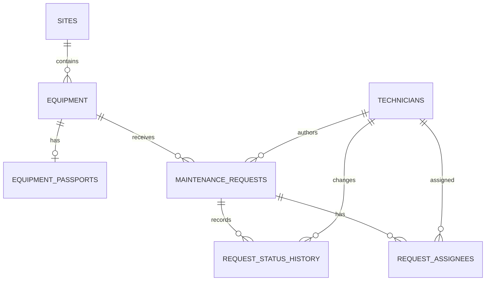
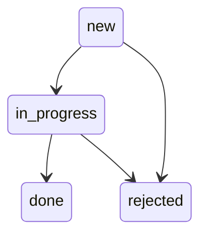

# Equipment Maintenance API

REST API на Express и PostgreSQL для учёта заявок на техническое обслуживание оборудования ветропарка. Сервис ведёт справочник площадок и оборудования, технические паспорта, специалистов и команды заявок, историю статусов, а также аналитические отчёты и прогноз погоды для наружных работ.

## Требования к окружению

- Node.js 20+
- npm 10+
- Docker Compose с поддержкой Compose v2

## Установка и запуск

Скопируйте `.env.example` в `.env` (`Copy-Item .env.example .env` в PowerShell, `cp .env.example .env` в Bash). Поменяйте демонстрационные значения секретов и паролей до запуска; `.env.example` содержит только локальные примеры и не должен использоваться в production.

```bash
npm install
docker compose up -d db
npm run db:deploy
npm run dev
```

`npm run db:deploy` — отдельный обязательный шаг развёртывания БД. Он последовательно применяет миграции, затем сиды, и останавливается с ошибкой, если любой шаг завершается неуспешно. Sequelize CLI хранит учёт выполненных миграций и сидов, поэтому повторный запуск не применяет уже учтённые изменения повторно. Выполняйте этот шаг после готовности PostgreSQL и до запуска или обновления API; сервер сам миграции и сиды не запускает. При запуске на хосте команда выполняется из корня проекта и использует `PGHOST`/`PGPORT` из `.env`.

Сервер стартует на `PORT` (по умолчанию `3000`); проверка: `http://localhost:3000/api/health`. PostgreSQL доступен с хоста на `PGPORT` (в примере `5433`). В контейнере API Compose переопределяет подключение на хост `db` и порт `5432`.

Для контейнерного развёртывания запустите PostgreSQL, выполните одноразовый сервис развёртывания БД, затем запускайте API:

```bash
docker compose up -d db
docker compose --profile deploy run --build --rm db-deploy
docker compose up --build api
```

`db-deploy` использует отдельную сборочную цель с Sequelize CLI и ждёт успешной проверки готовности PostgreSQL. Чтобы поднять весь стек после deploy-step, выполните `docker compose up --build`. PostgreSQL хранит состояние в именованном томе `pgdata`; `docker compose down` его сохраняет. `docker compose down -v` необратимо удаляет данные БД.

Сид рассчитан на однократный запуск в каждой БД и создаёт 2 площадки, 6 единиц оборудования с паспортами, 5 специалистов и 20 заявок во всех статусах, включая назначения и историю изменений. Sequelize CLI хранит отметку о выполнении сида; для повторного заполнения сначала отмените сид.

Данные сида синтетические. Скрипта импорта файлового хранилища из предыдущего кейса в репозитории нет; если нужно сохранить такие данные, экспортируйте их и перенесите отдельным импортом до запуска сида.

### Веб-интерфейс

После запуска сервера откройте `http://localhost:3000` в браузере — доступна простая страница со списком заявок, фильтрами и формой создания.

## Переменные окружения

| Переменная                     | Назначение                                                                                           | Пример                                   |
| ------------------------------ | ---------------------------------------------------------------------------------------------------- | ---------------------------------------- |
| `PORT`                         | Порт сервера                                                                                         | `3000`                                   |
| `NODE_ENV`                     | Режим (`development`/`production`/`test`) — в production скрываются внутренние сообщения 500-ошибок  | `development`                            |
| `CORS_ORIGINS`                 | Разрешённые origin через запятую                                                                     | `http://localhost:5173`                  |
| `RATE_LIMIT_WINDOW_MS`         | Окно ограничения частоты запросов, мс                                                                | `60000`                                  |
| `RATE_LIMIT_MAX`               | Макс. запросов за окно                                                                               | `100`                                    |
| `WEATHER_API_URL`              | URL погодного API (Open-Meteo forecast)                                                              | `https://api.open-meteo.com/v1/forecast` |
| `REQUEST_TIMEOUT_MS`           | Таймаут запроса к внешнему API                                                                       | `5000`                                   |
| `WEATHER_MAX_PRECIPITATION_MM` | Порог осадков для пригодности окна работ                                                             | `0`                                      |
| `WEATHER_MAX_WIND_SPEED_KMH`   | Порог скорости ветра                                                                                 | `20`                                     |
| `API_KEY`                      | Ключ для изменяющих операций (POST/PATCH/DELETE), заголовок `X-API-Key`                              | сгенерировать самостоятельно             |
| `POSTGRES_DB`                  | Имя БД, создаваемой контейнером PostgreSQL                                                           | `equipment_maintenance`                  |
| `POSTGRES_USER`                | Bootstrap-пользователь контейнера; сейчас его использует приложение и Sequelize CLI                  | `user`                                   |
| `POSTGRES_PASSWORD`            | Пароль `POSTGRES_USER`; задайте собственный локально                                                 | задать самостоятельно                    |
| `PGHOST`                       | Хост PostgreSQL для процесса приложения/CLI                                                          | `localhost`                              |
| `PGPORT`                       | Порт PostgreSQL на хосте; внутри Compose API использует `5432`                                       | `5433`                                   |
| `PGDATABASE`                   | База, к которой подключаются приложение и миграции                                                   | `equipment_maintenance`                  |
| `PGUSER`, `PGPASSWORD`         | Имя и пароль роли, создаваемой init-скриптом при первом запуске; задайте отдельно от `POSTGRES_USER` | `app_user` / собственный пароль          |

**Важно о DB-роли:** если `PGUSER` совпадает с `POSTGRES_USER`, отдельная роль не создаётся. Даже если задать отдельный `PGUSER`, текущий `src/database/sequelize.js` всё равно подключает API через `POSTGRES_USER`/`POSTGRES_PASSWORD`; ограниченная роль сейчас не используется. Init-скрипт выполняется только при создании пустого тома, поэтому изменение переменных не перенастроит уже созданную БД. Не публикуйте БД и не используйте демонстрационные пароли в production.

## Эндпоинты

| Метод  | Путь                                  | Назначение                                                                                                | Требует `X-API-Key` |
| ------ | ------------------------------------- | --------------------------------------------------------------------------------------------------------- | ------------------- |
| GET    | `/api/health`                         | Проверка доступности сервиса                                                                              | нет                 |
| GET    | `/api/equipment`                      | Список оборудования (фильтры: `type`, `status`; сортировка `sort`; пагинация `page`, `limit`)             | нет                 |
| POST   | `/api/equipment`                      | Создание оборудования                                                                                     | да                  |
| GET    | `/api/equipment/:id`                  | Карточка оборудования                                                                                     | нет                 |
| PATCH  | `/api/equipment/:id`                  | Частичное обновление                                                                                      | да                  |
| DELETE | `/api/equipment/:id`                  | Удаление (409, если есть незакрытые заявки)                                                               | да                  |
| GET    | `/api/equipment/:id/requests`         | Заявки по конкретной единице оборудования                                                                 | нет                 |
| GET    | `/api/equipment/:id/weather`          | Прогноз погоды и пригодность окна для наружных работ                                                      | нет                 |
| GET    | `/api/requests`                       | Список заявок (фильтры: `status`, `priority`, `equipmentId`, `dateFrom`, `dateTo`; сортировка; пагинация) | нет                 |
| POST   | `/api/requests`                       | Создание заявки                                                                                           | да                  |
| POST   | `/api/requests/bulk`                  | Массовый импорт заявок с частичным успехом (207)                                                          | да                  |
| GET    | `/api/requests/:id`                   | Карточка заявки                                                                                           | нет                 |
| PATCH  | `/api/requests/:id`                   | Редактирование полей заявки (без смены статуса)                                                           | да                  |
| PATCH  | `/api/requests/:id/status`            | Смена статуса с проверкой допустимости перехода                                                           | да                  |
| POST   | `/api/requests/:id/assignees`         | Замена команды заявки; требуется ровно один `lead`                                                        | да                  |
| DELETE | `/api/requests/:id/assignees/:userId` | Снятие специалиста с заявки                                                                               | да                  |
| GET    | `/api/requests/:id/history`           | История смены статусов заявки                                                                             | нет                 |
| DELETE | `/api/requests/:id`                   | Удаление заявки                                                                                           | да                  |
| GET    | `/api/sites/:id/summary`              | Сводный отчёт по площадке                                                                                 | нет                 |
| GET    | `/api/reports/equipment-load`         | Нагрузка на оборудование                                                                                  | нет                 |

Списочные эндпоинты возвращают `{ data: [...], meta: { total, page, limit } }`.

## Схема данных


```mermaid
erDiagram
  SITES ||--o{ EQUIPMENT : contains
  EQUIPMENT ||--o| EQUIPMENT_PASSPORTS : has
  EQUIPMENT ||--o{ MAINTENANCE_REQUESTS : receives
  TECHNICIANS ||--o{ MAINTENANCE_REQUESTS : authors
  MAINTENANCE_REQUESTS ||--o{ REQUEST_STATUS_HISTORY : records
  TECHNICIANS ||--o{ REQUEST_STATUS_HISTORY : changes
  MAINTENANCE_REQUESTS ||--o{ REQUEST_ASSIGNEES : has
  TECHNICIANS ||--o{ REQUEST_ASSIGNEES : assigned
```

`request_assignees` реализует связь N:M между заявками и специалистами. Составной первичный ключ `(request_id, technician_id)` запрещает повторно назначить одного специалиста на одну заявку; таблица также хранит роль и плановые часы. `equipment_passports.equipment_id` уникален, поэтому паспорт связан ровно с одной единицей оборудования.

Схема следует 3НФ: площадки, оборудование, паспорта, заявки, специалисты, история и назначения хранятся в отдельных таблицах; атрибуты каждой сущности зависят от её ключа, а данные специалиста и оборудования не дублируются в заявках/назначениях. Типы статусов, приоритетов и ролей ограничены PostgreSQL ENUM, внешние ключи обеспечивают ссылочную целостность.

История статусов не редактируется отдельными API-операциями. Удаление заявки каскадно удаляет её историю и назначения; удаление оборудования каскадно удаляет паспорта и заявки. Репозиторий запрещает удалять оборудование, пока у него есть заявки `new` или `in_progress` (ответ `409`); если все заявки закрыты, удаление оборудования удалит связанные заявки и их историю. Удаление площадки с привязанным оборудованием запрещено FK (`RESTRICT`).

## Схема переходов статуса заявки


```mermaid
stateDiagram-v2
    new --> in_progress
    new --> rejected
    in_progress --> done
    in_progress --> rejected
```

Из статусов `done` и `rejected` переходы запрещены. Попытка недопустимого перехода — `409 CONFLICT` (код ошибки `INVALID_TRANSITION`).

## Аналитические отчёты

- `GET /api/sites/:id/summary` возвращает количество заявок по статусам и приоритетам и среднее время закрытия в часах; если закрытых заявок нет, среднее равно `null`. Закрывающими считаются статусы `done` и `rejected`.
- `GET /api/reports/equipment-load` возвращает `equipmentId`, `equipmentName`, `serialNumber`, `requestCount`, `closedRequestCount`, `plannedHours` и `lastServiceAt`; последняя дата равна `null`, если оборудование не обслуживалось через заявку со статусом `done`. `dateFrom` и `dateTo` ограничивают период по `maintenance_requests.created_at`; `minRequests` фильтрует группы. `sort` принимает `equipmentName`, `requestCount`, `closedRequestCount`, `plannedHours` или `lastServiceAt`, `direction` — `ASC` или `DESC`. Значения по умолчанию: `minRequests=1`, `sort=requestCount`, `direction=DESC`, `limit=50`, `offset=0`; допустимы `limit` от 1 до 100 и `offset` от 0 до 100000.

Прямой SQL отчёта использует bind-параметры; имя колонки и направление сортировки выбираются из серверного белого списка. Ответ списка имеет вид `{ data: [...], meta: { total, limit, offset } }`.

**Статус валидации отчёта:** сейчас общий middleware возвращает `422 VALIDATION_ERROR` для неверных query-параметров, в том числе за пределами `limit`/`offset`. В задании для таких диапазонов требуется `400`; этот статус пока не реализован в маршруте отчёта.

## Миграции и откат

Миграции создают схему через Sequelize CLI. Для штатного развертывания используйте единый шаг `npm run db:deploy` (или `docker compose --profile deploy run --build --rm db-deploy` для контейнеров), который выполняет миграции и сиды в заданном порядке. Отменить последний сид: `npx sequelize-cli db:seed:undo`; отменить все сиды: `npx sequelize-cli db:seed:undo:all`.

Для отката схемы сначала отмените сиды, затем миграции:

```bash
npx sequelize-cli db:seed:undo:all
npx sequelize-cli db:migrate:undo:all
npm run db:deploy
```

Откат всех миграций удаляет таблицы и данные в настроенной БД. Используйте его только для локального/тестового окружения или после резервного копирования.

## Формат ответа об ошибке

Все ошибки API возвращаются в едином формате:

```json
{
  "error": {
    "code": "VALIDATION_ERROR",
    "message": "Некорректные данные запроса",
    "details": [{ "field": "priority", "message": "Invalid enum value" }],
    "requestId": "b1f2c3d4"
  }
}
```

`details` присутствует только для ошибок валидации. `requestId` возвращается в каждом ответе об ошибке и в заголовке `X-Request-Id` любого ответа — по нему можно найти соответствующую запись в логах сервера.

| Код ошибки                                | HTTP-статус | Когда возникает                                             |
| ----------------------------------------- | ----------- | ----------------------------------------------------------- |
| `VALIDATION_ERROR`                        | 422         | Некорректные данные в body/params/query                     |
| `NOT_FOUND`                               | 404         | Сущность или маршрут не найдены                             |
| `CONFLICT`                                | 409         | Дубль serialNumber, удаление equipment с открытыми заявками |
| `INVALID_TRANSITION`                      | 409         | Попытка недопустимого перехода статуса заявки               |
| `UNAUTHORIZED`                            | 401         | Отсутствует или неверен `X-API-Key` для изменяющей операции |
| `RATE_LIMIT_EXCEEDED`                     | 429         | Превышен лимит запросов                                     |
| `WEATHER_TIMEOUT` / `WEATHER_UNAVAILABLE` | 503         | Внешний погодный API не ответил вовремя или недоступен      |
| `INTERNAL_ERROR`                          | 500         | Непредвиденная ошибка сервера (детали скрыты в production)  |

Ошибки Zod-валидации body, params и query сейчас возвращаются как `422 VALIDATION_ERROR`. Синтаксически неверный JSON обрабатывается Express как `400`. Исключение, требуемое заданием для диапазона `limit`/`offset` отчёта, отмечено в разделе «Аналитические отчёты».

## Примеры запросов и ответов

### Создание оборудования

Запрос:

```http
POST /api/equipment
Content-Type: application/json
X-API-Key: <ключ>

{
  "name": "Turbine A",
  "type": "turbine",
  "serialNumber": "SN-001",
  "location": { "lat": 56.50049, "lon": 84.98216 },
  "status": "operational",
  "installedAt": "2024-01-01"
}
```

Ответ `201 Created` (заголовок `Location: /api/equipment/<id>`):

```json
{
  "id": "3f2504e0-4f89-11d3-9a0c-0305e82c3301",
  "name": "Turbine A",
  "type": "turbine",
  "serialNumber": "SN-001",
  "location": { "lat": 60.1, "lon": 24.9 },
  "status": "operational",
  "installedAt": "2024-01-01",
  "createdAt": "2026-09-20T10:00:00.000Z",
  "updatedAt": "2026-09-20T10:00:00.000Z"
}
```

### Ошибка валидации

Запрос:

```http
POST /api/equipment
Content-Type: application/json
X-API-Key: <ключ>

{ "type": "turbine" }
```

Ответ `422 Unprocessable Entity`:

```json
{
  "error": {
    "code": "VALIDATION_ERROR",
    "message": "Некорректные данные запроса",
    "details": [
      { "field": "name", "message": "Required" },
      { "field": "serialNumber", "message": "Required" },
      { "field": "location", "message": "Required" },
      { "field": "status", "message": "Required" },
      { "field": "installedAt", "message": "Required" }
    ],
    "requestId": "a1b2c3d4"
  }
}
```

### Недопустимый переход статуса

Запрос:

```http
PATCH /api/requests/<id>/status
Content-Type: application/json
X-API-Key: <ключ>

{ "status": "done" }
```

(если текущий статус заявки — `new`)

Ответ `409 Conflict`:

```json
{
  "error": {
    "code": "INVALID_TRANSITION",
    "message": "Переход из \"new\" в \"done\" недопустим",
    "requestId": "e5f6a7b8"
  }
}
```

### Массовый импорт заявок (частичный успех)

Запрос:

```http
POST /api/requests/bulk
Content-Type: application/json
X-API-Key: <ключ>

{
  "items": [
    { "equipmentId": "<id>", "title": "Успешная заявка", "priority": "low" },
    { "equipmentId": "00000000-0000-4000-8000-000000000000", "title": "Несуществующее оборудование", "priority": "low" }
  ]
}
```

Ответ `207 Multi-Status`:

```json
{
  "summary": { "total": 2, "succeeded": 1, "failed": 1 },
  "results": [
    { "index": 0, "success": true, "data": { "id": "...", "status": "new" } },
    {
      "index": 1,
      "success": false,
      "error": {
        "code": "NOT_FOUND",
        "message": "Оборудование с id=... не найдено"
      }
    }
  ]
}
```

### Запрос без API-ключа на изменяющую операцию

Ответ `401 Unauthorized`:

```json
{
  "error": {
    "code": "UNAUTHORIZED",
    "message": "Требуется корректный API-ключ",
    "requestId": "c3d4e5f6"
  }
}
```

## Безопасность

### Аутентификация по API-ключу

Все изменяющие операции (`POST`, `PATCH`, `DELETE`) требуют заголовок `X-API-Key`, значение которого сверяется с `API_KEY` из окружения. `GET`-эндпоинты открыты без ключа. При отсутствии или несовпадении ключа — `401 UNAUTHORIZED`.

### CORS

Разрешённые источники задаются явным списком через переменную окружения `CORS_ORIGINS` (через запятую), `*` не используется. Запросы без заголовка `Origin` (curl, Postman, серверные вызовы) разрешены — иначе тестирование через Postman было бы невозможно.

### Rate limiting

Все маршруты `/api/*`, кроме `/api/health`, ограничены по частоте запросов (`RATE_LIMIT_WINDOW_MS`, `RATE_LIMIT_MAX`). При превышении — `429` с заголовками `RateLimit-Limit`, `RateLimit-Remaining`, `RateLimit-Reset`. `/api/health` не ограничен, чтобы не мешать мониторингу.

### Прочее

- `helmet()` — стандартный набор защитных HTTP-заголовков, включая `Content-Security-Policy`. Из-за этого скрипт веб-интерфейса (`public/script.js`) вынесен в отдельный файл, а не оставлен инлайн в HTML — политика `script-src 'self'` блокирует инлайн-скрипты, и ослаблять ее ради одной страницы не стоило.
- Тело запроса ограничено 100kb (`express.json({ limit: '100kb' })`).
- Секреты и параметры окружения не коммитятся — в репозитории только `.env.example`.
- В `NODE_ENV=production` в ответах об ошибках скрываются внутренние сообщения и стек-трейсы непредвиденных (500) ошибок.

### Cookie

Проект не использует cookie — авторизация построена на API-ключе, передаваемом в заголовке запроса. Поэтому флаги `HttpOnly`/`Secure`/`SameSite` в этом решении неприменимы.

## Архитектура и структура проекта

Слоистая архитектура: **маршруты → контроллеры → сервисы → репозитории**. Бизнес-логика находится в сервисах, репозитории работают с PostgreSQL через Sequelize. Прямой SQL используется для отчёта по нагрузке на оборудование.

```
src/
  app.js              # сборка приложения (используется в тестах)
  server.js           # запуск сервера, отделён от app.js
  routes/             # объявление путей, без бизнес-логики
  controllers/        # разбор req/res, вызов сервисов
  services/           # бизнес-логика: equipmentService, requestService,
                       # statusTransitions.js, weatherService.js
  repositories/        # доступ к данным через Sequelize и SQL
  database/migrations/ # версионируемая схема PostgreSQL
  database/seeders/    # демонстрационные данные
  middlewares/        # requestId, validate, apiKeyAuth, errorHandler, notFoundHandler
  validators/          # Zod-схемы для body/params/query
  errors/              # AppError и наследники
  config/              # corsConfig.js, rateLimitConfig.js, weatherConfig.js
scripts/
  db-deploy.js         # последовательный шаг применения миграций и сидов
public/                # статическая HTML-страница (index.html, script.js)
tests/                 # Jest + Supertest
docs/postman/          # Postman-коллекция Case 3
compose.yaml, Dockerfile
```

## Особенности реализации на Express 5

- Async-обработчики в Express 5 автоматически передают отклонённые промисы в error-handler (эквивалент `next(err)`), поэтому кастомный `asyncHandler`/`express-async-errors` не используется — все контроллеры представляют собой простые `async function`.
- `req.query` в Express 5 — read-only геттер. Результат валидации query-параметров кладётся не обратно в `req.query`, а в `req.valid.query`; из соображений единообразия то же самое сделано и для `req.valid.body`/`req.valid.params`.

## Тестирование

### Postman

Коллекция — [`docs/postman/Equipment Maintenance API.postman_collection.json`](docs/postman/Equipment%20Maintenance%20API.postman_collection.json). Перед запуском Collection Runner выполните отдельный шаг `npm run db:deploy` (или контейнерный deploy-step), затем задайте переменные коллекции согласно настройке API; `baseUrl` по умолчанию `http://localhost:3000`. Demo IDs площадки, оборудования и специалистов соответствуют фиксированным ID сида `dataSeed.cjs`.

Коллекция содержит позитивные сценарии назначения/снятия специалиста, истории заявки, сводки площадки и отчёта по оборудованию. Группа `Case 3 Negative Scenarios` проверяет 404 для отсутствующего специалиста, 409 при дублировании специалиста и переводе в `in_progress` без команды, а также 422 для команды без `lead`. Запускайте запросы в порядке коллекции: setup-запросы записывают созданные ID в переменные, cleanup удаляет временные заявки.

### Автотесты (Jest + Supertest)

```bash
npm test
```

Перед запуском убедитесь, что `PGDATABASE` указывает на отдельную тестовую БД и схема создана миграциями. Jest выставляет `NODE_ENV=test`, но runtime-конфигурация Sequelize сейчас подключается к имени из `PGDATABASE` напрямую.

Тесты покрывают CRUD equipment/requests, переходы статусов, вложенные роуты, отчётные endpoints и погодный эндпоинт (с замоканным `fetch`).

## Дополнительные возможности

- **Docker Compose** — PostgreSQL хранит состояние в именованном томе `pgdata`.
- **Автотесты Jest + Supertest** — см. раздел «Тестирование».
- **Аутентификация по API-ключу** — заголовок `X-API-Key` для всех изменяющих операций.
- **Массовый импорт заявок** — `POST /api/requests/bulk`, до 50 записей за раз, частичный успех с отчётом по каждой записи (`207 Multi-Status`).
- **HTML-страница** — `public/index.html` + `public/script.js`, список заявок с фильтрами и форма создания, работает через `fetch` к тому же серверу.
