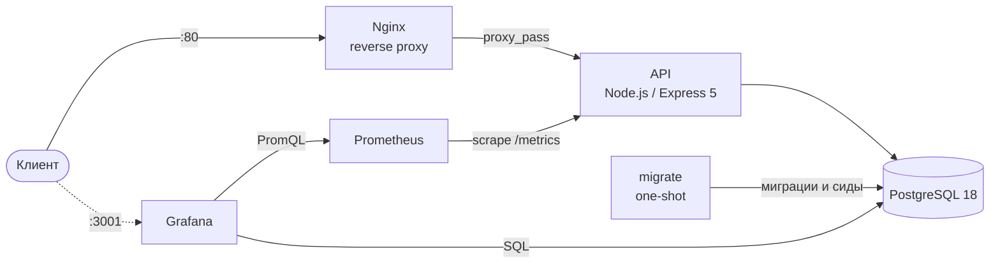
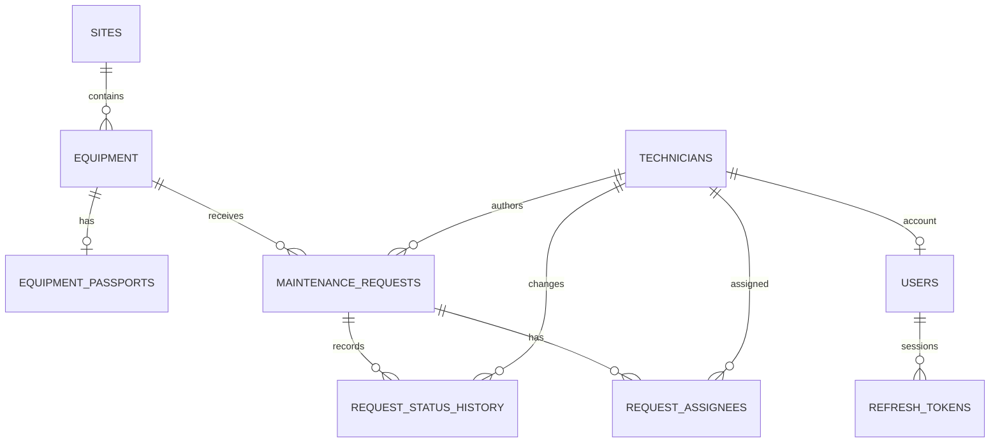
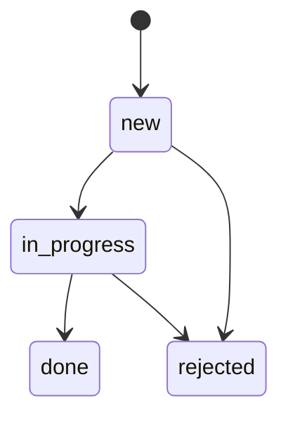

# Equipment Maintenance API

REST API на Express и PostgreSQL для учёта заявок на техническое обслуживание оборудования ветропарка: справочник площадок и оборудования, технические паспорта, специалисты, заявки с контролем жизненного цикла и журналом статусов, назначение бригад, аналитические отчёты и прогноз погоды для наружных работ.

Сервис защищён аутентификацией (JWT + refresh-cookie) и ролевой моделью, разворачивается одной командой за обратным прокси Nginx и наблюдаем через Prometheus и Grafana.

## Схема стека


```mermaid
flowchart LR
    client([Клиент]) -->|:80| nginx[Nginx<br/>reverse proxy]
    nginx -->|proxy_pass| api[API<br/>Node.js / Express 5]
    api --> db[(PostgreSQL 18)]
    migrate[migrate<br/>one-shot] -->|миграции и сиды| db
    prometheus[Prometheus] -->|scrape /metrics| api
    grafana[Grafana] -->|PromQL| prometheus
    grafana -->|SQL| db
    client -.->|:3001| grafana
```

| Сервис | Назначение | Порт на хосте |
|---|---|---|
| `nginx` | Обратный прокси, сжатие, таймауты, Basic Auth на `/metrics` | `80` |
| `api` | Приложение (Express 5, Sequelize 6) | не публикуется |
| `db` | PostgreSQL 18, данные в томе `pgdata` | `127.0.0.1:${PGPORT}` (только loopback) |
| `migrate` | Одноразовый сервис: миграции и сиды, затем завершается | — |
| `prometheus` | Сбор метрик приложения, том `prometheus-data` | не публикуется |
| `grafana` | Дашборд и алерты, том `grafana-data` | `3001` |

Снаружи приложение и база напрямую недоступны: весь API-трафик идёт через Nginx.

## Развёртывание с нуля

Требования: Docker с Compose v2. Node.js на машине для запуска стека не нужен.

```bash
git clone https://github.com/Landin-droid/express-equipment-service.git
cd express-equipment-service
cp .env.example .env        # PowerShell: Copy-Item .env.example .env
# заполните в .env все пустые значения (пароли, секреты) — см. таблицу про переменные окружения
docker compose up -d --build
```
Про значения переменных — см. [Переменные окружения](#переменные-окружения).

Порядок старта обеспечивается зависимостями и проверками готовности: `db` (healthcheck `pg_isready`) → `migrate` (применяет миграции и сиды и завершается с кодом 0) → `api` (healthcheck на `/api/health/ready`) → `nginx`. Если миграция упала, `api` не стартует.

Проверка:

```bash
docker compose ps -a # migrate: Exited (0), остальные Up / healthy
curl http://localhost/api/health/ready
# {"status":"ok","database":"up"}
```

| Адрес | Что там |
|---|---|
| `http://localhost/` | Простая веб-страница со списком заявок |
| `http://localhost/api/docs` | Swagger UI (OpenAPI), можно авторизоваться и выполнять запросы |
| `http://localhost:3001` | Grafana (`GRAFANA_ADMIN_USER` / `GRAFANA_ADMIN_PASSWORD`) |
| `http://localhost/metrics` | Метрики Prometheus, Basic Auth (`METRICS_USER` / `METRICS_PASSWORD`) |

Демо-учётные записи создаёт сид из переменных `SEED_*`: администратор и технолог (привязан к специалисту из сида данных). Регистрация через API создаёт пользователей с ролью `viewer`.

Если порт 80 занят другим веб-сервером (например, локальным Apache/IIS), измените публикацию в `compose.yaml` (`"8080:80"`), архитектура от этого не меняется.

Остановка и сброс:

```bash
docker compose down    # данные сохраняются в томах
docker compose down -v # ВНИМАНИЕ: удаляет данные БД, Prometheus и Grafana
```

## Режим разработки

```bash
npm install
docker compose up -d db
npm run db:migrate
npm run db:seed
npm run dev # http://localhost:3000, без Nginx
```

Миграции и сиды с хоста используют `PGHOST`/`PGPORT` из `.env` (по умолчанию `localhost:5433`). Внутри Compose `api` и `migrate` подключаются к `db:5432` — эти значения переопределены в `compose.yaml`.

## Переменные окружения

Все параметры перечислены в `.env.example`; секретов в репозитории нет.

| Переменная | Назначение | Пример |
|---|---|---|
| `PORT` | Порт приложения внутри контейнера | `3000` |
| `NODE_ENV` | `development` / `production` / `test`. В production скрываются детали 500-ошибок и включается флаг `Secure` у refresh-cookie | `development` |
| `LOG_LEVEL` | Уровень логирования pino (`debug`, `info`, `warn`, `error`, `silent`) | `info` |
| `CORS_ORIGINS` | Разрешённые origin через запятую | `http://localhost` |
| `RATE_LIMIT_WINDOW_MS`, `RATE_LIMIT_MAX` | Общий лимит запросов к `/api` | `60000`, `100` |
| `WEATHER_API_URL` | URL погодного API (Open-Meteo) | `https://api.open-meteo.com/v1/forecast` |
| `REQUEST_TIMEOUT_MS` | Таймаут запроса к внешнему API | `5000` |
| `WEATHER_MAX_PRECIPITATION_MM`, `WEATHER_MAX_WIND_SPEED_KMH` | Пороги пригодности окна для наружных работ | `0`, `20` |
| `POSTGRES_DB`, `POSTGRES_USER`, `POSTGRES_PASSWORD` | Суперпользователь БД: создание кластера и миграции (DDL) | |
| `PGHOST`, `PGPORT`, `PGDATABASE` | Параметры подключения (с хоста) | `localhost`, `5433`, `equipment_maintenance` |
| `PGUSER`, `PGPASSWORD` | Ограниченная роль приложения (только CRUD, без DDL), создаётся init-скриптом при первом запуске тома | |
| `ACCESS_TOKEN_SECRET` | Секрет подписи access-токена | длинная случайная строка |
| `ACCESS_TOKEN_TTL` | Срок жизни access-токена | `15m` |
| `REFRESH_TOKEN_TTL_DAYS` | Срок жизни refresh-токена | `7` |
| `METRICS_USER`, `METRICS_PASSWORD` | Basic Auth на `/metrics` в Nginx | |
| `GRAFANA_ADMIN_USER`, `GRAFANA_ADMIN_PASSWORD` | Администратор Grafana | |
| `SEED_ADMIN_EMAIL`, `SEED_ADMIN_PASSWORD` | Демо-администратор | |
| `SEED_TECHNICIAN_EMAIL`, `SEED_TECHNICIAN_PASSWORD` | Демо-технолог | |

Init-скрипт Postgres выполняется только при создании пустого тома: смена `PGUSER`/`PGPASSWORD` после первого запуска не перенастроит существующую БД (для этого `docker compose down -v` или `ALTER ROLE`).

## Аутентификация

| Эндпоинт | Назначение |
|---|---|
| `POST /api/auth/register` | Регистрация, роль `viewer` |
| `POST /api/auth/login` | Выдаёт access-токен в теле и refresh-токен в cookie |
| `POST /api/auth/refresh` | Новый access-токен по refresh-cookie, refresh-токен ротируется |
| `POST /api/auth/logout` | Отзывает refresh-токен, удаляет cookie |
| `GET /api/auth/me` | Текущий пользователь и роль |

- **Пароли** хранятся только как хеш bcrypt (12 раундов, соль внутри хеша). Ни пароль, ни хеш не попадают в ответы API и логи.
- **Access-токен** — JWT, подпись `ACCESS_TOKEN_SECRET`, срок `ACCESS_TOKEN_TTL` (15 минут), передаётся в заголовке `Authorization: Bearer <token>`.
- **Refresh-токен** — непрозрачная случайная строка (не JWT); в БД хранится только её SHA-256 хеш. Передаётся в cookie `refreshToken`: `HttpOnly`, `Secure` (в production), `SameSite=Strict`, `Path=/api/auth`. При каждом обновлении старый токен отзывается и выдаётся новый: повторное использование украденного токена после легитимного обновления не сработает.
- **Почему `SameSite=Strict`:** у сервиса нет сценариев входа с переходом с внешних сайтов (OAuth и т.п.), UI и API работают на одном origin через Nginx, поэтому Strict безопаснее Lax и ничего не ломает. Cookie ограничена путём `/api/auth` и не уходит на остальные запросы.
- **Вход** защищён отдельным лимитом (5 попыток за 15 минут по IP), сообщение «Неверный email или пароль» одинаково для несуществующего пользователя и неверного пароля.

## Роли и права

Чтение доступно любому аутентифицированному пользователю. Запрос без токена — `401`, без достаточных прав — `403`.

| Операция | viewer | technician | admin |
|---|:-:|:-:|:-:|
| Чтение: оборудование, заявки, история, сводка по площадке, отчёты, погода | ✓ | ✓ | ✓ |
| Создание и редактирование заявок (`POST /requests`, `POST /requests/bulk`, `PATCH /requests/:id`) | — | ✓ | ✓ |
| Смена статуса заявки (`PATCH /requests/:id/status`) | — | только назначенные на него заявки | ✓ любые |
| Создание, изменение, удаление оборудования | — | — | ✓ |
| Назначение и снятие бригады (`POST/DELETE .../assignees`) | — | — | ✓ |
| Удаление заявок | — | — | ✓ |

Публичные эндпоинты: `/api/auth/register|login|refresh|logout`, `/api/health/*`, `/api/docs`. `/metrics` защищён Basic Auth на уровне Nginx. Управление ролями через API не предусмотрено: роль меняется в БД (`UPDATE users SET role = ...`).

## Эндпоинты

| Метод | Путь | Назначение |
|---|---|---|
| GET | `/api/health/live` | Жизнеспособность процесса |
| GET | `/api/health/ready` | Готовность (проверяет БД), `503` при недоступной БД. `/api/health` — алиас |
| GET | `/metrics` | Метрики Prometheus |
| GET | `/api/docs` | Swagger UI |
| GET / POST | `/api/equipment` | Список (фильтры `type`, `status`, сортировка, пагинация) / создание |
| GET / PATCH / DELETE | `/api/equipment/:id` | Карточка с паспортом / обновление / удаление |
| GET | `/api/equipment/:id/requests` | Заявки по оборудованию |
| GET | `/api/equipment/:id/weather` | Прогноз и пригодность для наружных работ |
| GET / POST | `/api/requests` | Список (фильтры `status`, `priority`, `equipmentId`, `dateFrom`, `dateTo`) / создание заявок |
| POST | `/api/requests/bulk` | Массовый импорт, частичный успех (`207`) |
| GET / PATCH / DELETE | `/api/requests/:id` | Карточка с назначенными специалистами / правка полей / удаление |
| PATCH | `/api/requests/:id/status` | Смена статуса с проверкой перехода |
| POST | `/api/requests/:id/assignees` | Замена бригады (ровно один `lead`) |
| DELETE | `/api/requests/:id/assignees/:userId` | Снятие специалиста |
| GET | `/api/requests/:id/history` | История статусов |
| GET | `/api/sites/:id/summary` | Сводка по площадке |
| GET | `/api/reports/equipment-load` | Нагрузка на оборудование (raw SQL, JOIN, GROUP BY, HAVING) |

Полное описание параметров, тел и ответов — в Swagger UI (`/api/docs`) и в `docs/openapi.yaml`. Списки возвращают `{ data: [...], meta: { total, page, limit } }`.

## Модель данных


```mermaid
erDiagram
    SITES ||--o{ EQUIPMENT : contains
    EQUIPMENT ||--o| EQUIPMENT_PASSPORTS : has
    EQUIPMENT ||--o{ MAINTENANCE_REQUESTS : receives
    TECHNICIANS ||--o{ MAINTENANCE_REQUESTS : authors
    MAINTENANCE_REQUESTS ||--o{ REQUEST_STATUS_HISTORY : records
    TECHNICIANS ||--o{ REQUEST_STATUS_HISTORY : changes
    MAINTENANCE_REQUESTS ||--o{ REQUEST_ASSIGNEES : has
    TECHNICIANS ||--o{ REQUEST_ASSIGNEES : assigned
    TECHNICIANS ||--o| USERS : account
    USERS ||--o{ REFRESH_TOKENS : sessions
```

- `request_assignees` — связь N:M с составным ключом `(request_id, technician_id)`, ролью (`lead`/`member`) и плановыми часами.
- `equipment_passports.equipment_id` уникален — связь 1:1.
- Схема в 3НФ; статусы, приоритеты и роли — нативные ENUM PostgreSQL; все ключи — `uuid`.
- Правила удаления: площадку с оборудованием удалить нельзя (`RESTRICT`); оборудование с заявками `new`/`in_progress` удалить нельзя (`409`, проверка в транзакции), закрытые заявки удаляются каскадом вместе с историей и назначениями; специалиста, являющегося автором заявок или записей журнала, удалить нельзя (`RESTRICT`).
- `users.technician_id` связывает учётную запись технолога с записью специалиста: по ней проверяется, назначен ли он на заявку.

### Жизненный цикл заявки


```mermaid
stateDiagram-v2
    [*] --> new
    new --> in_progress
    new --> rejected
    in_progress --> done
    in_progress --> rejected
```

Из `done` и `rejected` переходов нет (`409 INVALID_TRANSITION`). Перевод в `in_progress` без назначенной бригады — `409 ASSIGNEES_REQUIRED`.

### Границы транзакций

- Создание заявки: заявка и первая запись журнала статусов.
- Смена статуса: `SELECT ... FOR UPDATE` строки заявки, проверка перехода и бригады, обновление и запись в журнал. Любая ошибка — полный откат; параллельная смена статуса одной заявки сериализуется блокировкой.
- Замена бригады: блокировка заявки, удаление прежних назначений, вставка новых, проверка «ровно один lead»; нарушение откатывает всё, прежняя бригада остаётся.
- Удаление оборудования: блокировка строки и проверка открытых заявок в одной транзакции.

## Формат ответа об ошибке

```json
{
  "error": {
    "code": "VALIDATION_ERROR",
    "message": "Некорректные данные запроса",
    "details": [{ "field": "priority", "message": "Invalid enum value" }],
    "requestId": "b1f2c3d4"
  }
}
```

`requestId` совпадает с заголовком `X-Request-Id`, записью в `access_log` Nginx (`rid=`) и логами приложения.

| Код | HTTP | Когда |
|---|---|---|
| `VALIDATION_ERROR` | 422 | Некорректные body/params/query |
| `UNAUTHORIZED` | 401 | Нет или недействителен токен, неверные учётные данные |
| `FORBIDDEN` | 403 | Недостаточно прав |
| `NOT_FOUND` | 404 | Сущность или маршрут не найдены |
| `CONFLICT` | 409 | Дубли, удаление оборудования с открытыми заявками |
| `INVALID_TRANSITION` | 409 | Недопустимый переход статуса |
| `ASSIGNEES_REQUIRED` | 409 | Перевод в работу без бригады |
| `RATE_LIMIT_EXCEEDED` | 429 | Превышен лимит запросов или попыток входа |
| `WEATHER_TIMEOUT` / `WEATHER_UNAVAILABLE` | 503 | Погодный API недоступен |
| `INTERNAL_ERROR` | 500 | Непредвиденная ошибка (детали скрыты в production) |

## Безопасность

- Nginx: заголовки `Host`, `X-Real-IP`, `X-Forwarded-For`, `X-Forwarded-Proto`; приложение доверяет прокси (`trust proxy`), поэтому лимиты и логи видят реальный IP клиента. Заданы таймауты проксирования, `client_max_body_size 1m`, `gzip`.
- `/metrics` закрыт Basic Auth (`.htpasswd` генерируется при старте контейнера из переменных окружения). IP-фильтр по подсети Docker не используется: на Docker Desktop трафик с хоста выглядит для Nginx как внутренний.
- `helmet`, явный список CORS-источников, ограничение тела запроса (100 КБ), общий лимит запросов и отдельный лимит на вход.
- Приложение работает под ограниченной ролью БД без права DDL; контейнеры `api` и `migrate` запускаются не от root, `dev`-зависимости в образ `api` не попадают.
- SQL-запросы параметризованы (`bind`), поля сортировки проверяются по белому списку.

## Мониторинг

Prometheus опрашивает `api:3000/metrics` внутри сети Compose. Grafana поднимается с автоматически подключёнными источниками данных и дашбордом (provisioning из `deploy/grafana/`), ручная настройка не нужна.

Дашборд **Equipment Maintenance Service**:

| Панель | Источник |
|---|---|
| Интенсивность запросов по маршрутам | Prometheus |
| Доля ответов 4xx и 5xx | Prometheus |
| Время ответа p95 | Prometheus |
| Доступность сервиса (`up`) | Prometheus |
| Заявки по статусам и приоритетам | PostgreSQL |
| Среднее время закрытия заявки | PostgreSQL |
| Нагрузка на оборудование (топ-10) | PostgreSQL |

Приложение отдаёт `http_requests_total` и `http_request_duration_seconds` (метка `route` — шаблон пути, а не реальный URL) и стандартные метрики процесса Node.js.

**Оповещение** `High 5xx error ratio`: доля ответов 5xx > 5% в течение 5 минут. Порядок действий (также указан в описании алерта в Grafana):

1. На дашборде найти маршрут с ошибками (панели «4xx / 5xx» и «Интенсивность запросов»).
2. Взять `requestId` из ответа или логов (`docker compose logs api | grep '"statusCode":5'`).
3. Проверить `/api/health/ready` и `docker compose ps`.
4. Ошибки `WEATHER_*` означают недоступность внешнего погодного API, остальные эндпоинты не затронуты.
5. При `INTERNAL_ERROR` разобрать стек по `requestId`, при необходимости откатить версию.

Подробно: [docs/RUNBOOK.md](docs/RUNBOOK.md).

## Тестирование

```bash
docker compose up -d db
npm test
```

Одна команда прогоняет модульные и интеграционные тесты (Jest + Supertest) и печатает отчёт о покрытии (HTML-отчёт в `coverage/`). Тесты изолированы: используется отдельная БД `<PGDATABASE>_test` (создаётся и мигрируется автоматически), данные очищаются перед каждым тестом, внешний погодный API подменён заглушкой.

- Модульные: переходы статусов, правило «ровно один lead», проверка прав по ролям.
- Интеграционные: регистрация, вход, refresh и logout, `401` без токена, `403` для недостаточных прав, CRUD, `409` на конфликты, отчёты, сводка, погода.

Postman-коллекция лежит в `docs/postman/` и включает сценарии аутентификации и негативные случаи.

## Структура проекта

```
src/
  app.js, server.js        # сборка приложения отделена от запуска
  routes/ controllers/ services/ repositories/
  models/                  # модели и ассоциации Sequelize
  database/                # подключение, config.cjs, migrations/, seeders/
  middlewares/             # auth, validate, requestId, requestLogger, metrics, errorHandler
  validators/              # Zod-схемы
  errors/  config/
deploy/
  nginx/                   # Dockerfile, nginx.conf, генерация .htpasswd
  prometheus/              # prometheus.yml
  grafana/                 # provisioning: datasources, dashboards, alerting; JSON дашборда
docs/
  openapi.yaml  RUNBOOK.md  postman/
tests/                     # unit/, integration/ и сценарные тесты
db/init/                   # init-скрипт роли приложения
Dockerfile  compose.yaml
```

Слои: **маршруты → контроллеры → сервисы → репозитории**. Бизнес-логика — в сервисах, SQL и Sequelize — только в репозиториях.

## Архитектурные решения

- **Express 5**: асинхронные ошибки обработчиков попадают в error-handler автоматически, собственный `asyncHandler` не нужен. `req.query` в Express 5 доступен только для чтения, поэтому результат валидации лежит в `req.valid.*`.
- **Zod** для валидации body, params и query одним middleware; ошибка содержит перечень полей. Статус `422` для ошибок валидации.
- **Репозиторий скрывает схему**: внешний контракт API сохранён при переходе на PostgreSQL (поле `location` вычисляется из площадки, `siteId` — расширение).
- **Refresh-токены непрозрачные и хранятся хешем** с ротацией: отзыв — запись в БД, без дополнительных секретов.
- **Гибридный мониторинг**: технические панели строятся по метрикам Prometheus, прикладные читают PostgreSQL напрямую теми же запросами, что и отчёты API.
- **`request id` сквозной**: генерируется Nginx (`$request_id`), приложение переиспользует его в логах и ответах.
- **Миграции — отдельный шаг развёртывания** (сервис `migrate`): DDL выполняет суперпользователь, приложение живёт с урезанными правами.

## Известные ограничения

- HTTPS не настроен: TLS терминируется вне стека, Nginx слушает только `80`. Флаг `Secure` у cookie включается при `NODE_ENV=production` и требует HTTPS (браузеры делают исключение для `localhost`).
- Grafana опубликована напрямую на `3001`, а не через Nginx.
- Нет контакт-пойнта для алертов; срабатывание видно только в интерфейсе Grafana.
- Лимиты запросов хранятся в памяти процесса `api`: при нескольких репликах счётчики не общие.
- Просроченные refresh-токены не удаляются фоновой задачей.
- Управления пользователями и ролями через API нет; `OpenAPI` описывается вручную и требует синхронизации с кодом.
- Недоступность погодного API возвращает `503` и учитывается в доле 5xx, поэтому может сработать алерт без неисправности самого сервиса.
- Ограничения `limit`/`offset` отчёта возвращают `422`, а не `400` из текста задания, ради единообразия с остальным API.
- При запуске под Windows через `nodemon` сигналы остановки не доходят до процесса; корректное завершение проверяется через Docker (`docker compose stop api`) или прямым `node src/server.js`.

## Эксплуатация

Где смотреть логи и метрики, что делать при типовых отказах и как откатить миграции — в [docs/RUNBOOK.md](docs/RUNBOOK.md).
